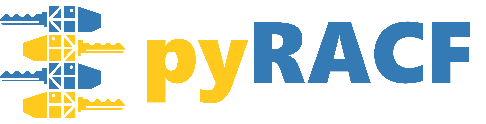

[](https://bestpractices.coreinfrastructure.org/projects/8437)


Python interface into the RACF management application programming interface.

```python
>>> from pyracf import UserAdmin
>>> user_admin = UserAdmin()
>>> user_admin.get_omvs_uid("squidwrd")
2424
>>> user_admin.set_omvs_uid("squidwrd", 1919)
>>> user_admin.get_omvs_uid("squidwrd")
1919
```

## Description

As automation becomes more and more prevalent, the need to manage the security environment programmatically increases. On z/OS that means managing a security product like the IBM Resource Access Control Facility (RACF). RACF is the primary facility for managing identity, authority, and access control for z/OS. There are more than 50 callable services with assembler interfaces that are part of the RACF API.

[RACF callable services interfaces](http://publibz.boulder.ibm.com/epubs/pdf/ich2d112.pdf)

 While there are a number of languages that can be used to manage RACF, (from low level languages like Assembler to higher level languages like REXX), the need to have it in a language that is used to manage other platforms is paramount. The pyRACF project is focused on making the RACF management tasks available to Python programmers. This will make it easier to manage RACF from management tools like Ansible and Tekton.

## Getting Started

### Dependencies

* z/OS 2.4 and higher.
* R_SecMgtOper (IRRSMO00): Security Management Operations.
* [The appropriate RACF authorizations](https://www.ibm.com/docs/en/zos/2.5.0?topic=operations-racf-authorization)

### Installation

:warning: _pyRACF will eventually be made available on [pypi.org](https://pypi.org/), but currently python wheel distributions for pyRACF are only available for manual download and installation via GitHub._

* [Download & Install From GitHub](https://github.com/ambitus/pyracf/releases)

### Usage

* [pyRACF Documentation](https://ambitus.github.io/pyracf/)

## Help

* [GitHub Discussions](https://github.com/ambitus/pyracf/discussions)

## Report Bugs/Vulnerabilities & Request Enhancements

:warning: _You may also report **vulnerabilities** privately by emailing this project's [Maintainers](#maintainers). This method is preferred if the vulnerability is high severity._

* [GitHub Issues](https://github.com/ambitus/pyracf/issues)

## Authors

* Joe Bostian: jbostian@ibm.com
* Frank De Gilio: degilio@us.ibm.com
* Leonard Carcaramo: lcarcaramo@ibm.com
* Elijah Swift: Elijah.Swift@ibm.com

## Maintainers

* Leonard Carcaramo: lcarcaramo@ibm.com
* Elijah Swift: Elijah.Swift@ibm.com